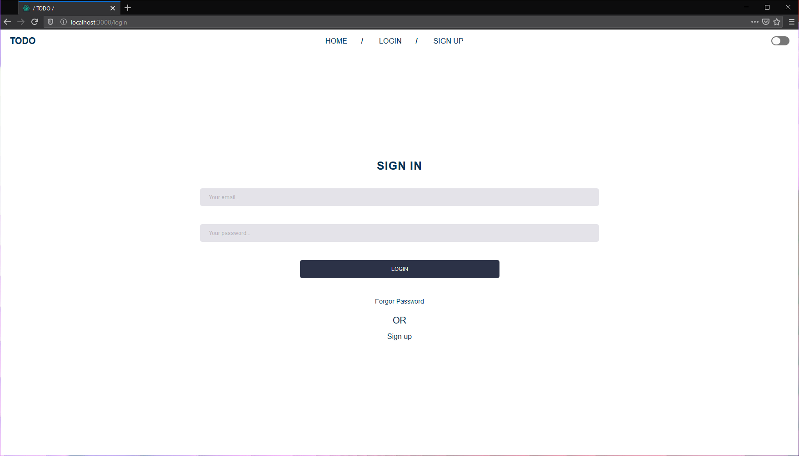
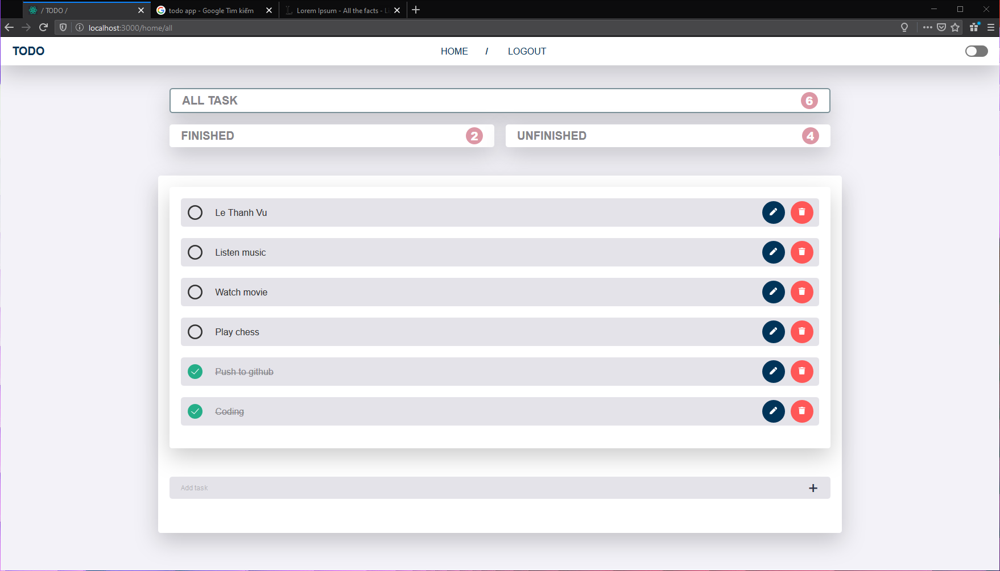
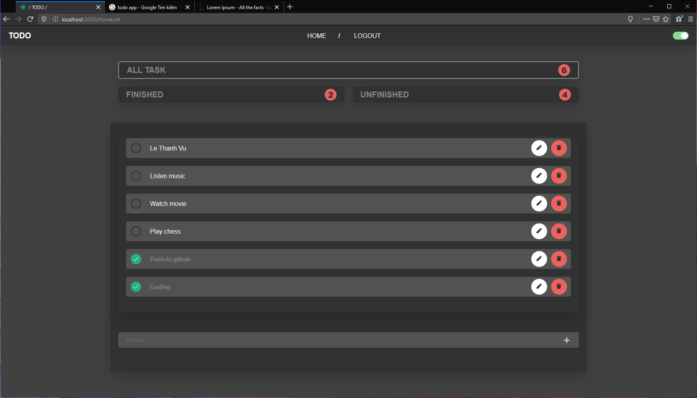

# Todo App with DarkMode, Firebase Auth





### Installing

Clone the Repository and run

```
npm install
npm start
```

## Built With

- [React JS](https://reactjs.org/)
- [React Router](https://github.com/ReactTraining/react-router)
- [Redux](https://redux.js.org/)
- [Redux Thunk](https://github.com/reduxjs/redux-thunk)
- [Styled Components](https://www.styled-components.com)
- [Firebase & Firestore](https://firebase.google.com)
- [React Icons](https://react-icons.netlify.com/)

## Authors

- **Vu** - _Development_ - [thanhvule0310](https://github.com/thanhvule0310)
